# Map Quiz

Map Quiz is a multiple choice quiz where players are given an Irish county nickname and they have to select the correct county. There are four options on every question, with ten questions in total.

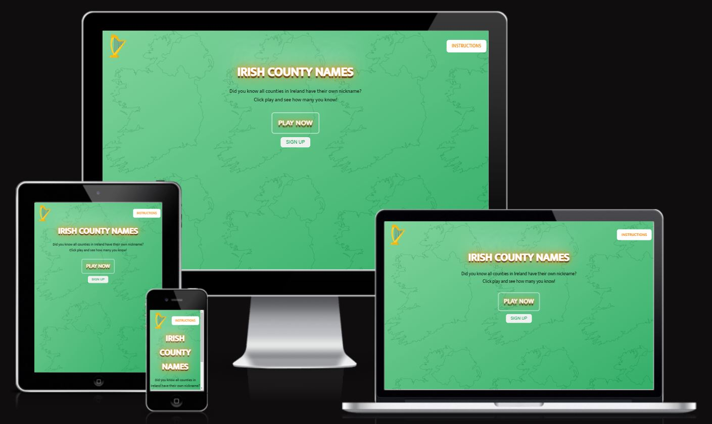

[Map Quiz](https://fintanmi.github.io/map-quiz/)

## Features

### Site Wide
* Logo in the header to allow players to return to the home page
* Favicon
   * A harp is featured on each page
   * This will provide a visual element for a player to easily identify the page if they have multiple tabs open
   
 
*Home Page*
- Game instructions button in the header to explain what the quiz is about
- Harp icon in the header that the user can click once the quiz has started that will bring them back to the home page
- A brief explanation of what the quiz is about
- Play button to initiate the quiz
- Sign up button that displays a modal, allowing players to sign up in order to get access to the full range of games
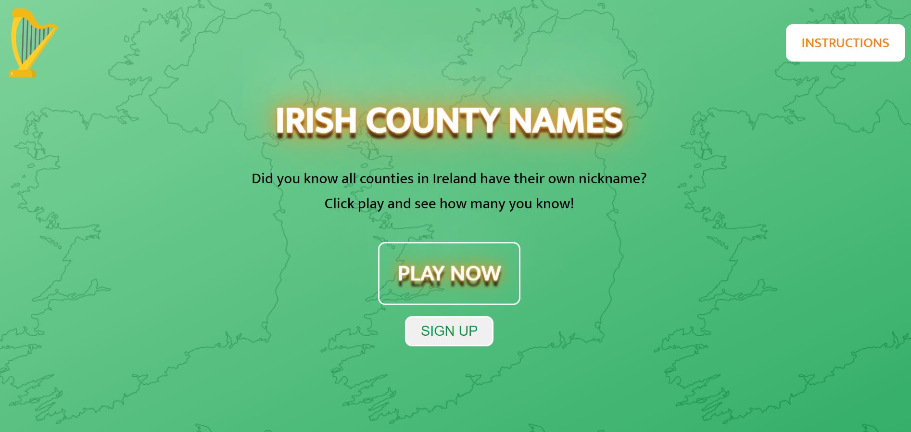

*Sign Up Modal*
- A modal pops up with serveral input fields for a player to upload their name, email and password if they wish to join
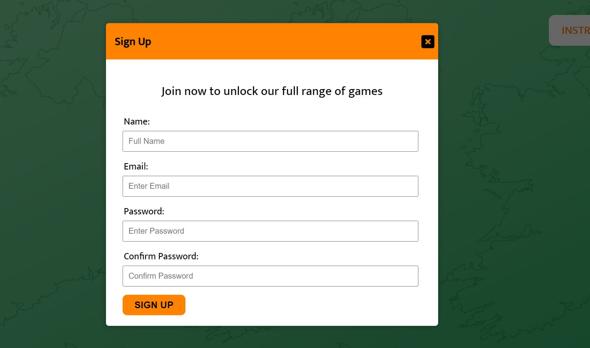

*Instructions*
- Tells players how to play the quiz
- Button links to the quiz page
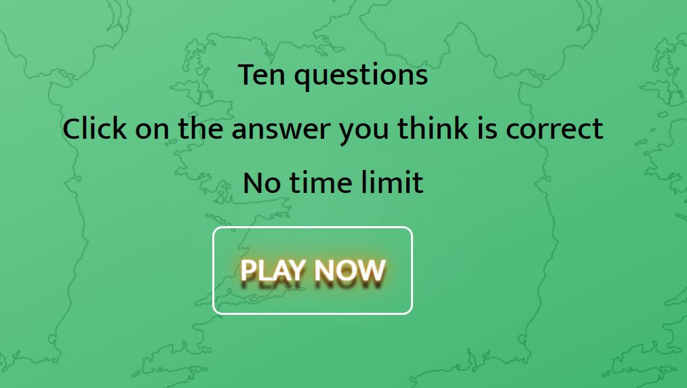

*Quiz Pages*
- Question counter with a progress bar to show how many questions have been answered
- Score counter to show how many questions the player has answered correctly
- Neon written effects on either side of the quiz container to give an arcade feel
- Quiz container with the question on top and the four possible answer below
- The answer will flash green (correct answer) or red (wrong answer) for half a second before changing to the next question
- The score begins at zero and each correct answer will add ten to their score, meaning the best score a player can acheive is one hundred
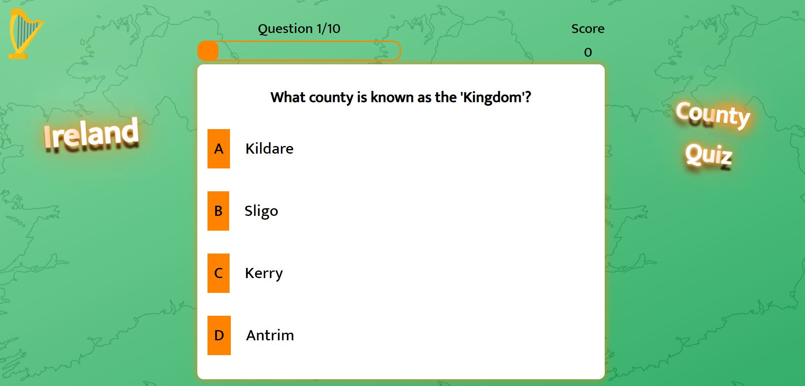

*Finish Page*
- The player will see a play again button that will divert them back to the home page


## Wireframes

- Home Page
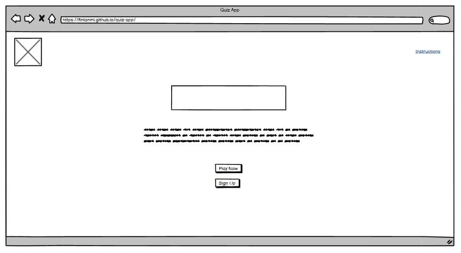
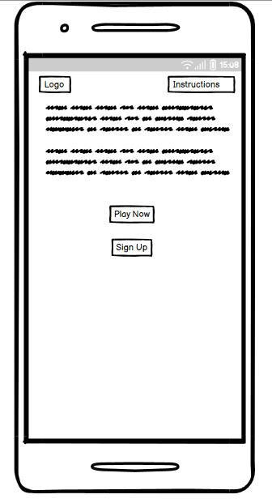

- Sign Up Modal
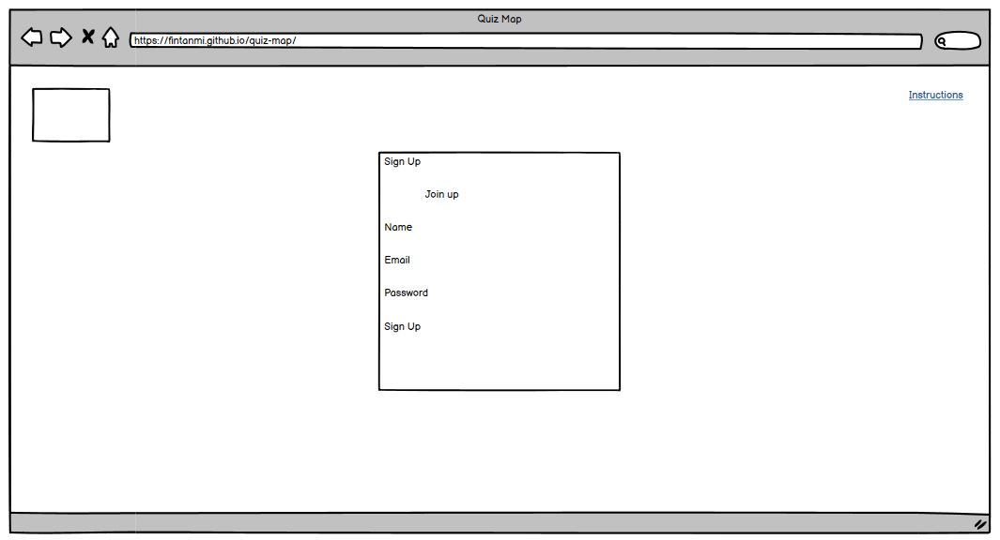

- Instructions Page
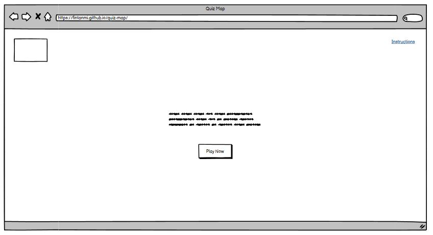

- Quiz Page
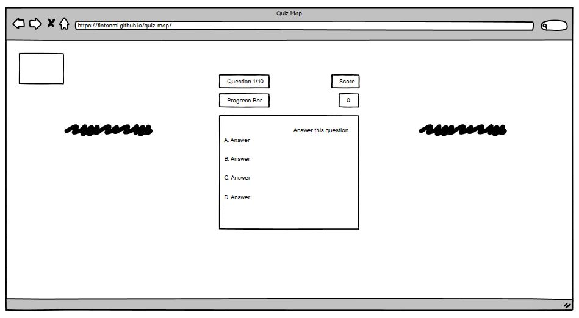
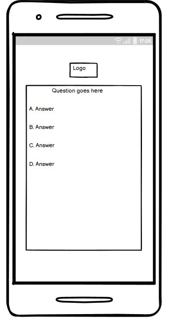

## Technologies

- HTML
  - The structure of the website was developed using HTML
- CSS
  - The Website was styled using custom CSS in external files
- JavaScript
  - The game play logic was created using JavaScript in external files
- GitHub
  - Source code is hosted on GitHub and delpoyed using Git Pages.
- Gitpod
  - Used to commit and push code during the development of the Website
- Favicon.io
  - favicon file was created at https://favicon.io/favicon-converter/
- balsamiq
  - wireframes were created using balsamiq from https://balsamiq.com/wireframes/desktop/

## Testing

### Responsiveness

All pages were tested to ensure the layout was correctly displaying the quiz all device sizes down to 280 pixels.

Steps to test:

1. Open browser and navigate to [Quiz App](https://fintanmi.github.io/map-quiz/)
2. Open the developer tools (right click and inspect)
3. Set to responsive and set zoom to 50%
4. Go through each of the device types to ensure the layout is correct

Expected:

Website is responsive on all screen sizes
No horizontal scroll is present
No elements overlap

Actual:

Website behaved as expected.

### Accessibility

**Lighthouse Report**

Lighthouse report generated scores ranging from 92 to 100
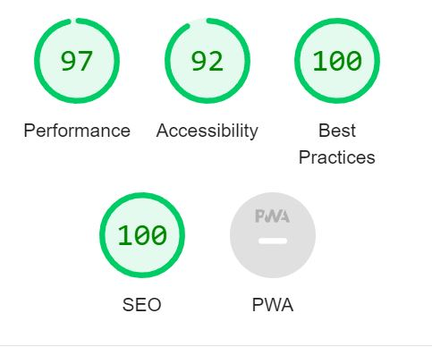

Manual tests were performed to ensure the each answer highlighted green or red depending on if the correct or incorrect answer was selected before the next question appeared. This was acheived by clicking on each option.

Testing was also performed to ensure that when the logo was clicked on the quiz pages it brought the player back to the home page. This was done by clicking on the logo when a new question loaded.

**Validator Testing**

-HTML
  - Three errors relating to the same id name been used was highlighted when passed through [W3C validator](https://validator.w3.org)
  - Changes were implemented
 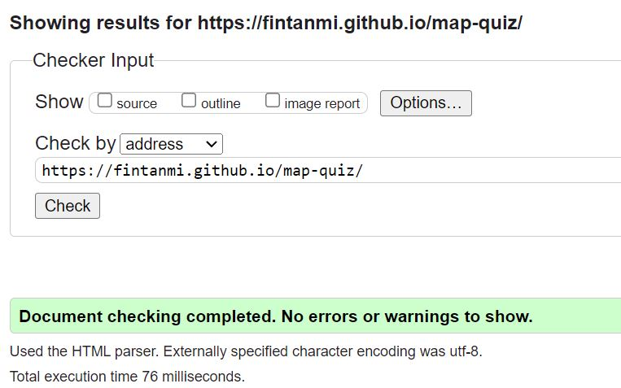
 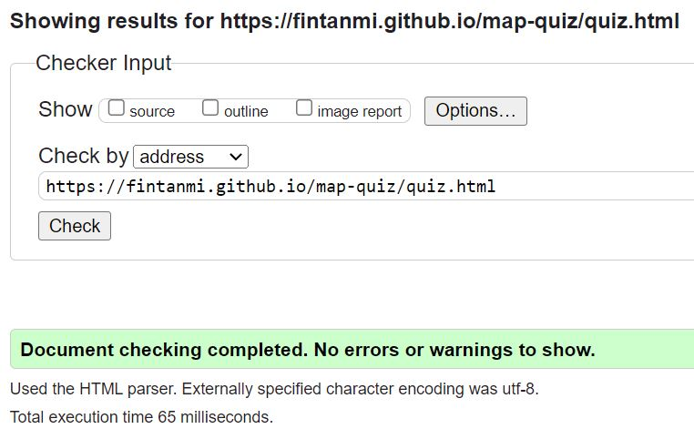

-CSS
  - No errors found when put through [(Jigsaw) validator](https://jigsaw.w3.org)
  
  
 -Javascript
  - No errors when put through [JShint validator](https://jshint.com/)
  - Numerous warnings were present regarding const/let/arrow functions/template literal syntax/spread operator
  - Four undefined variables were declared but each one they're used for bringing in the quiz content, progress bar and updating the score
  
  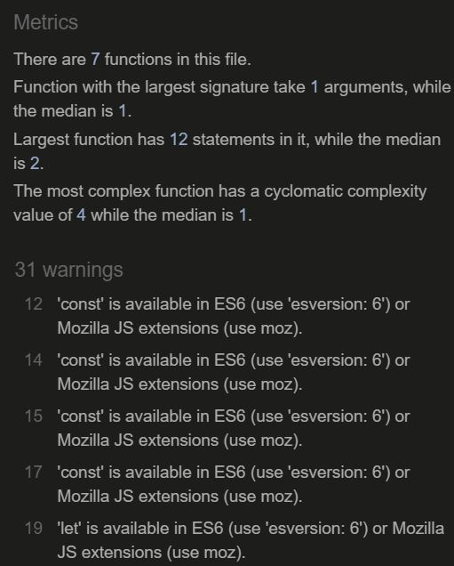
  
 ## Deployment
 
 ### Version Control

The site was created using gitpod and pushed to github to a remote repository

The following git commands were used throughout development to push code to the remote repository:

```git add .``` - This command was used to add all files to the staging area before they are committed

```git commit -m “commit message”``` - This command was used to commit changes to the local repository queue ready for the final step

```git push``` - This command was used to push all committed code to the remote repository on github

### Deployment to Github Pages

- The site was deployed to GitHub pages. The steps to deploy are as follows:
  - In the GitHub repository, navigate to the Settings tab
  - From the menu on left select 'Pages'
  - From the source section drop-down menu, select the Branch: main
  - Click 'Save'
  - A live link will be displayed in a green banner when published successfully.

The live link can be found here - https://fintanmi.github.io/map-quiz/

### Clone the Repository Code Locally

Navigate to the GitHub Repository you want to clone to use locally:

- Click on the code drop down button
- Click on HTTPS
- Copy the repository link to the clipboard
- Open your IDE of choice (git must be installed for the next steps)
- Type git clone copied-git-url into the IDE terminal

The project will now have been cloned on your local machine for use.

## Credits

* Some JavaScript was used from the Udemy courses '50 Projects in 50 Days - HTML, CSS and JavaScript' and '20 Web Projects with Vanilla JavaScript'
